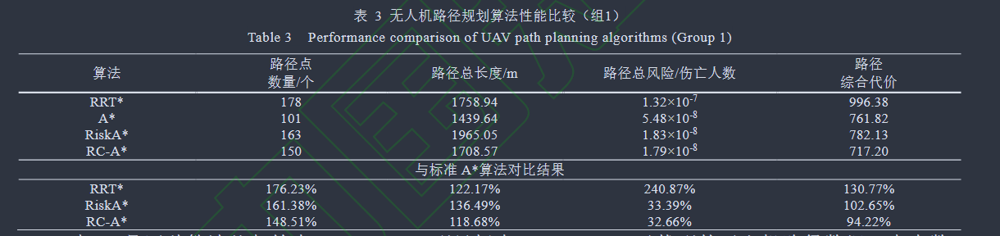
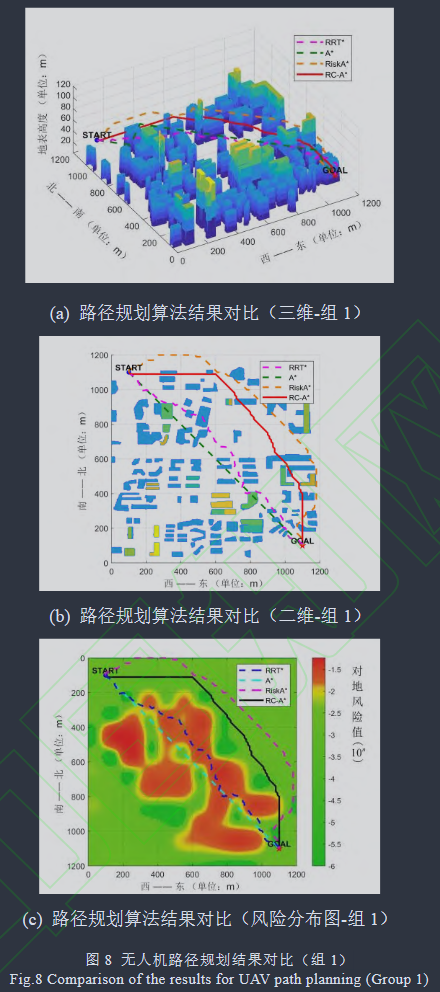

> **导读**：在城市低空物流与交通场景中，无人机若只追求“航程最短”，航线往往会横穿高密度人群区域；一旦空中失控坠落，将对地面造成严重威胁。论文《基于风险约束的城市空域无人机安全路径规划》，从计算机科学（CS）与算法实现视角，拆解其提出的 **RC-A\*（Risk-Constrained A\*）** 算法的核心逻辑。

---

## 1. 论文基本信息与研究动机

* **论文题目**：基于风险约束的城市空域无人机安全路径规划
* **作者团队**：朱元军、李妍、张学军、张维东（北京航空航天大学 电子信息工程学院 / 空地一体新航行系统技术全国重点实验室）
* **发表期刊**：《北京航空航天大学学报》
* **核心痛点**：
  * **传统寻路算法的局限**：标准 $A^*$ 或 RRT\* 仅将“几何距离最短 / 耗时最少”作为单一优化目标，默认所有无障碍栅格的通行代价等同。
  * **低空运行的衍生风险**：城市空域中，无人机断电或电机失效会因重力下坠，若航线横穿商业街或学校，会造成极其严重的地面人员伤亡。路径规划必须在“航程距离”与“对地安全风险”之间实现多目标权衡。

---

## 2. 空间建模与三维风险矩阵构建

论文将城市空域离散化为三维栅格点云集合 $P_{n,m,l}$：

* **静态障碍物矩阵**：$B(i,j,h) \in \{0, 1\}$，用于标记建筑物占据情况，取反后得到可用空域节点集合 $U_{n,m,l}$。
* **三维运行风险矩阵**：$R_{n,m,l}$，每个单元网格 $(i,j,h)$ 的数值代表飞机在该点失控坠落造成的人员伤亡期望（单位：伤亡人数/飞行小时）：
  $$R(i,j,h) = P(LOC) \cdot R_f(i,j,h)$$
  * $P(LOC)$：无人机空中失效坠毁概率。
  * $R_f$（最终地面风险）：由初始地面风险（人群密度 $D_{peo} \times$ 坠毁伤亡面积 $A_{cas}$）与风险缓解措施效果矩阵 $M$ 做哈达玛积计算。
  * 缓解措施包含两部分：地面建筑物遮蔽系数 $M_1$（掩体保护降低致死率）以及机载应急降落伞 $M_2$（开伞减速衰减撞击动能）。

---

## 3. RC-A\* 算法的核心改进机制

针对传统 $A^*$ 代价评估公式 $F(r) = G(r) + H(r)$，作者设计了三项针对性改进：

| 改进维度 | 标准 $A^*$ 算法 | 改进 RC-A\* 算法 |
| :--- | :--- | :--- |
| **实际代价 $G(r)$** | 仅累加欧氏几何距离。 | 综合累加飞行距离与归一化风险代价：$G(r) = G(r-1) + \alpha_1 Cost_{dist}^r + \alpha_2 Cost_{norm,risk}^r$。 |
| **启发式 $H(r)$** | 仅计算当前点到终点的欧氏直线距离。 | 引入动态立方体包围盒风险预估，综合预估距离与包围盒内的风险分布特征（均值与中位数极小值）。 |
| **搜索方向与剪枝** | 单步无约束全向扩展 26 个邻居节点。 | 引入最大转向角约束（$\theta_{UAV} \le 60^\circ$），单步仅向航向前方锥形区域内的 9 个节点扩展。 |

### 关键技术细节解析
1. **风险代价归一化**：由于伤亡概率数值（如 $10^{-8}$）与物理距离（百米级）数量级差异巨大，直接相加会导致风险项被忽略。论文采用区域风险均值与中位数的较小值 $R_{norm}$ 进行归一化映射。
2. **动态立方体风险预估**：以当前节点 $RP_r$ 与目标点 $GOAL$ 为空间对角线构建长方体包围盒，统计其内部所有格子的风险分布 $R_{pred}(r) = \min(R_{avg}, R_{med})$，引导搜索前瞻性地避开前方高危空域。
3. **航向角度剪枝**：限制单步偏航角不超过 $\pi/3$，单步搜索邻域从 26 节点减少至 9 节点，将搜索空间压缩 65%，有效降低算法运算时间并避免急转弯。

---

## 4. 实验验证与性能对比

* **仿真环境**：深圳市南山区真实区域（$1200\text{m} \times 1200\text{m} \times 90\text{m}$），融合 OpenStreetMap 建筑物数据与 WorldPop 全球真实人口密度数据。
* **对比基线 (Baselines)**：标准 $A^*$、RRT\*、RiskA\*。

**实验组 1 核心数据对比：**

* **标准 $A^*$ 算法**：路径长度 $1439.64\text{ m}$，路径总风险 $5.48 \times 10^{-8}$，综合代价 $761.82$。
* **改进 RC-A\* 算法**：路径长度 $1708.57\text{ m}$，路径总风险 $1.79 \times 10^{-8}$，综合代价 $717.20$。
* **量化收益**：RC-A\* 相比标准 $A^*$，**航程仅增加 18.68%，但使地面人员总伤亡风险降低了 67.34%**，综合代价降低 5.78% 并达到全局最优。二维热力图显示其航迹精准绕开了高密度人流聚集区。
  
  

---

## 5. 个人思考与科研/大创拓展

作为计算机专业本科生，这篇论文提供了一个非常清晰的“问题约束驱动算法改进”范例：

* **算法可解释性与工程价值**：通过引入现实约束矩阵，把看似属于航天控制的问题转化为了经典图搜索与启发式函数设计。
* **可拓展方向**：
  1. **前端寻路 + 后端平滑**：RC-A\* 输出的依然是离散的折线网格点，后续可引入安全飞行走廊（SFC）与贝塞尔曲线（Bézier Curve），将航路打磨为动力学平滑轨迹。
  2. **动态与时变约束**：本文使用的是静态风险地图，未来可在仿真中加入动态气象风场或突发临时禁飞区，研究局部在线重规划逻辑。